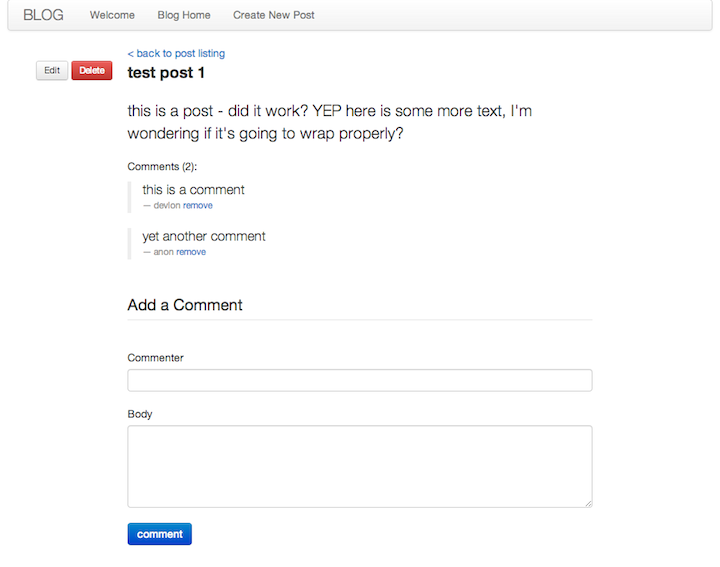
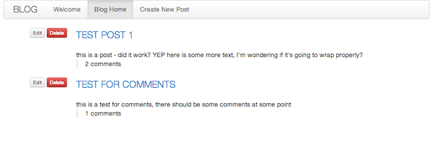

rblog
=====

### Playing with the [Ruby on Rails Blog Example](http://guides.rubyonrails.org/getting_started.html/ "getting started").

##### single post screen-cap
- - -

##### post listing screen-cap
- - -

##### TODO:

* replace tutorial db with something I haven't used before, maybe Postgres
* spice up the styling (done, used bootstrap-sass - can rubi-fy it a bit more)
